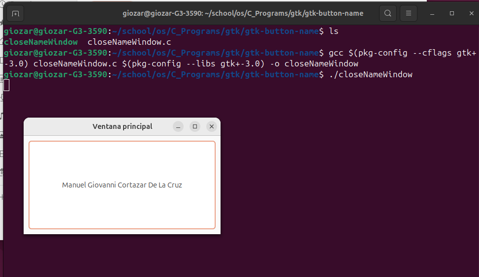
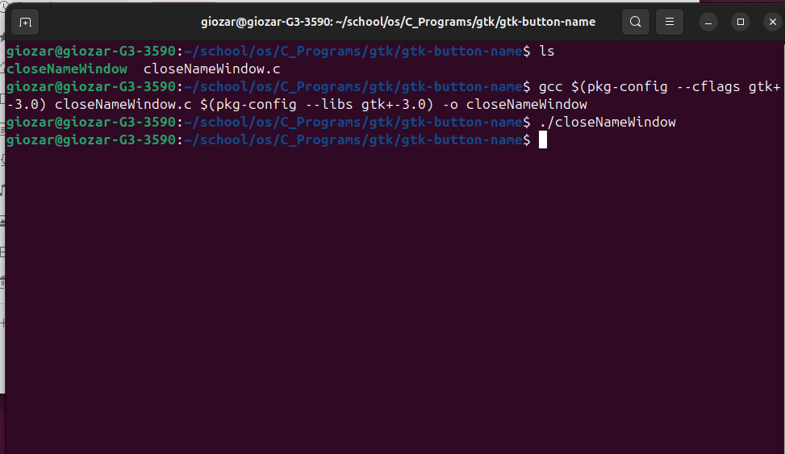

# closeNameWindow

## Descripción

`closeNameWindow` es un programa en C que utiliza GTK+ 3.0 para crear una ventana con un botón. El botón contiene el nombre "Manuel Giovanni Cortazar De La Cruz". Al hacer clic en el botón, la aplicación se cierra.

## Dependencias

Asegúrate de tener GTK+ 3.0 instalado en tu sistema. Puedes instalarlo con:

```bash
sudo apt-get install libgtk-3-dev
```

## Compilación
Para compilar el programa, ejecuta:

```bash
gcc $(pkg-config --cflags gtk+-3.0) closeNameWindow.c $(pkg-config --libs gtk+-3.0) -o closeNameWindow
```

## Ejecución
Para ejecutar el programa compilado, usa:
```bash
./closeNameWindow
```

## Capuras de ejecución
- Programa en ejecución



- Prohrama terminado


